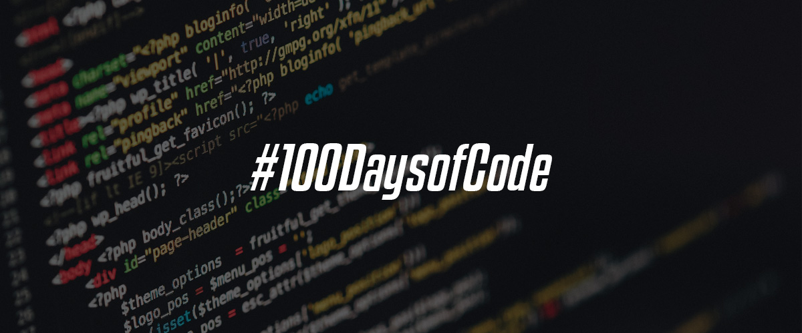

# 100 Days of Code: The Complete Python Pro Bootcamp

## About 

I pledge to complete this 100 days of python 🐍 coding challenge #100DaysOfCode in a quest to master Python programming language. This repo contains code and notes which I have taken. I document the learning experience on twitter, follow me to stay upto date [@amirdora_](https://twitter.com/amirdora_). 
 
 
 ## 👨🏻‍🎓 Beginner

* [Day 01](/Day01)

* [Day 02](/Day02)

* [Day 03](/Day03)

* [Day 04](/Day04)

* [Day 05](/Day05)

* [Day 06](/Day06)

* [Day 07](/Day07)

* [Day 08](/Day08)

* [Day 09](/Day09)

* [Day 19](/Day10)

## 🏋🏻‍♂️ Intermediate 
